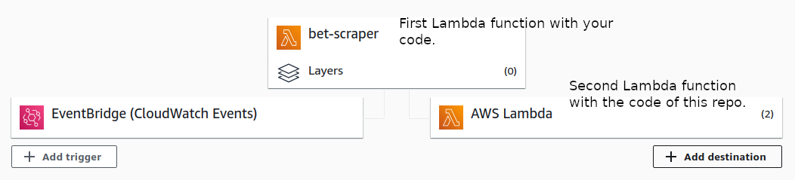
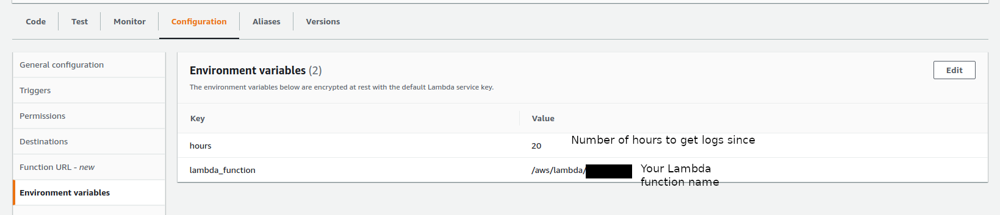

# Cloudwach to Telegram
This repository contains the files needed to send logs from AWS CloudWatch to Telegram using Lambda functions.
The methods in this repository could be used to send normal messages or to send files to a Telegram group.

The idea with this repository is to configure an additional Lambda function to send the generated logs of the previous Lambda function execution to a Telegram group.
For doing so, that second Lambda function has to be configured with two environment variables:

- **hours**: Number of hours to get logs since.
- **lambda_function**:  Name of the Lambda function to be executed. Format */aws/lambda/<lambda_function>*.

Both parameters are used for filtering the logs (by lambda function and by the start time of that function).

For example, if we execute our Lambda function and then configure the second Lambda function to send the logs of the previous execution, that second function will be executed inmediately after the first one, so the **hours** environment variable has to be set with the number of hours from which we want to start filtering logs for that function.

[More information here](https://medium.com/@ivangomezarnedo/how-to-improve-the-monitoring-of-your-lambda-processes-with-telegram-45b2edf1a250)